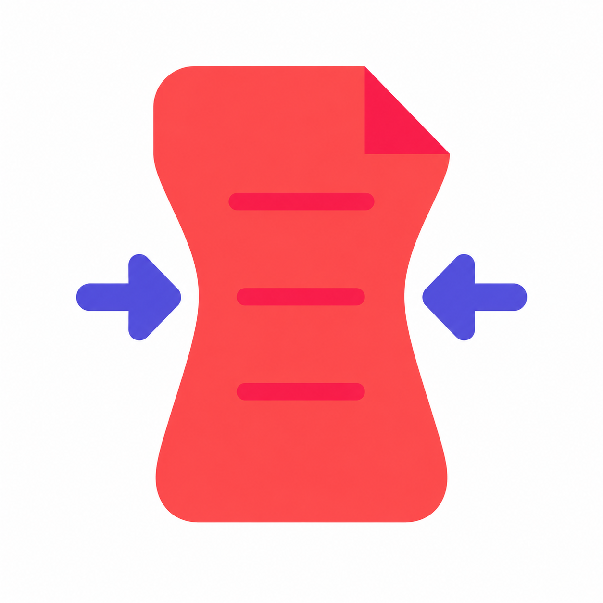

<p align="center">
  
</p>

<h1 align="center">FS PDF Compressor</h1>

<p align="center">
  Fast and Simple PDF compression for macOS. Drag, drop, done.
</p>

<p align="center">
  <a href="https://gitlares.github.io/fs-pdf-compressor/">Website</a>
  ·
  <a href="https://github.com/gitlares/fs-pdf-compressor/releases/latest">Download</a>
  ·
  <a href="CONTRIBUTING.md">Contribute</a>
  ·
  <a href="https://www.paypal.com/donate/?hosted_button_id=7RDCBR3QXXEMJ">♥ Support</a>
  ·
  <a href="PRIVACY.md">Privacy</a>
</p>

FS PDF Compressor is a deliberately small, native-feeling macOS utility. It
compresses PDFs locally with Ghostscript and keeps the technical choices out of
the way.

## Features

- Drag and drop one PDF, several PDFs, or a folder.
- Balanced compression by default, with two optional quality profiles.
- Replaces the original only when the result is smaller.
- Optional **Keep original** mode creates a separate compressed copy.
- Processes everything locally: no uploads, accounts, analytics or telemetry.
- Includes Ghostscript, so end users do not need Homebrew or a separate install.

## Download

Download the latest DMG from [GitHub Releases](https://github.com/gitlares/fs-pdf-compressor/releases/latest).

The current binary supports Apple Silicon and requires macOS 26 or later. It is
Developer ID signed and Apple-notarized, so it opens normally with Gatekeeper
enabled.

## Build from source

Requirements: Apple Silicon Mac, macOS 26+, Homebrew and Python 3.12.

```shell
brew install python@3.12 ghostscript
python3.12 -m venv .build-venv
.build-venv/bin/python -m pip install -r requirements-build.txt
.build-venv/bin/python build_macos.py
```

The app and DMG are written to `release/`. The build bundles Ghostscript and its
non-system dynamic libraries, copies detected license files, and rewrites their
Mach-O paths. Local builds use an ad-hoc signature unless a Developer ID
identity is supplied; see [the release guide](docs/RELEASING.md) for the
notarized distribution workflow.

## Contributing

Issues, translations, accessibility improvements and focused pull requests are
welcome. Read [CONTRIBUTING.md](CONTRIBUTING.md) before submitting changes. If
the app is useful to you, starring and sharing the repository also helps.

## Support the project

If FS PDF Compressor saves you time, you can support its continued development
with an optional [PayPal donation](https://www.paypal.com/donate/?hosted_button_id=7RDCBR3QXXEMJ).
The app remains free and open source for everyone.

## Privacy

PDFs never leave your Mac. See the short [privacy statement](PRIVACY.md).

## License

FS PDF Compressor is released under the GNU Affero General Public License v3.0
or later. The distributed app bundles Ghostscript 10.07.1 under the AGPL and
other open-source libraries; see [THIRD_PARTY_NOTICES.md](THIRD_PARTY_NOTICES.md).

Copyright © 2026 Daniel Lares.
