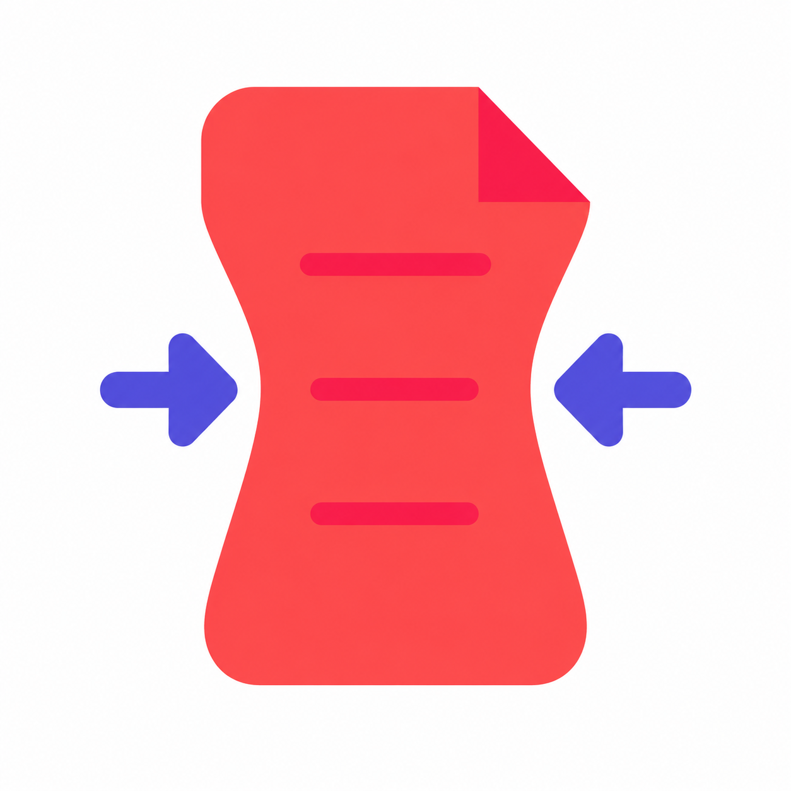
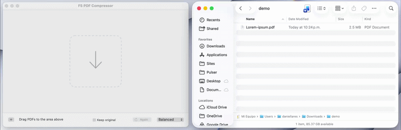
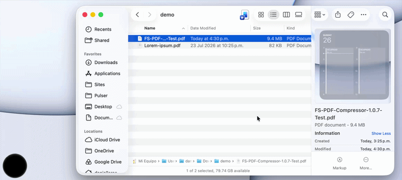

<p align="center">
  
</p>

<h1 align="center">FS PDF Compressor</h1>

<p align="center">
  FS = Fast &amp; Simple: free, private PDF compression for Mac and Linux. Drag, drop, done.
</p>

<p align="center">
  <a href="https://gitlares.github.io/fs-pdf-compressor/">Website</a>
  ·
  <a href="https://github.com/gitlares/fs-pdf-compressor/releases/latest">Download</a>
  ·
  <a href="CONTRIBUTING.md">Contribute</a>
  ·
  <a href="https://www.paypal.com/donate/?hosted_button_id=7RDCBR3QXXEMJ">♥ Support</a>
  ·
  <a href="PRIVACY.md">Privacy</a>
</p>

<p align="center">
  
</p>

FS PDF Compressor — **Fast & Simple PDF Compressor** — is a deliberately
small, free PDF compressor for Mac and Linux. It compresses PDFs locally with
Ghostscript, so you can compress PDF files without uploading them to a website.
It is a private, open-source PDF compressor for Apple Silicon Macs and x86_64
Linux, with a self-contained AppImage for Linux users.

## Features

- Drag and drop one PDF, several PDFs, or a folder.
- Balanced compression by default, with two optional quality profiles.
- Replaces the original only when the result is smaller.
- Optional **Keep original** mode creates a separate compressed copy.
- Processes everything locally: no uploads, accounts, analytics or telemetry.
- Includes Ghostscript, so end users do not need Homebrew or a separate install.
- macOS distribution is Developer ID signed and notarized by Apple.

### Drop Zone

**Drop Zone** is an optional shortcut for compressing PDFs without reopening
the main window. It gives FS PDF Compressor a little personality while keeping
the workflow fast: leave the small target on the desktop and drop PDFs onto it
whenever they need to be compressed. Double-click it to reopen the main window.

<p align="center">
  
</p>

- On **macOS**, choose **FS PDF Compressor → Show Drop Zone**. The Drop Zone is
  available in every Space (virtual desktop). Uncheck the same menu item to
  hide and disable it. **Launch at Login** in the same menu is optional.
- On **Linux**, choose **Application → Show Drop Zone** and uncheck it to hide
  and disable it. X11 desktops can keep it at desktop level. Under Wayland, the
  compositor controls window placement and stacking, so the app cannot
  reliably pin it to the desktop layer; it may appear as a normal floating
  utility. We are investigating better Wayland integration.

The setting and position are remembered. Drop Zone stays idle without polling
the filesystem and uses the same local compression engine and selected quality
profile as the main window.

## Download

- **macOS 14+ on Apple Silicon:** [download the signed and notarized DMG](https://github.com/gitlares/fs-pdf-compressor/releases/latest).
- **Linux x86_64:** [download the self-contained AppImage](https://github.com/gitlares/fs-pdf-compressor/releases/latest/download/FS-PDF-Compressor-x86_64.AppImage).

The macOS build is Developer ID signed and Apple-notarized, so it opens
normally with Gatekeeper enabled. The Linux AppImage is portable and bundles
Ghostscript; make it executable and run it, or use the per-user installer:

```sh
curl -fsSLO https://raw.githubusercontent.com/gitlares/fs-pdf-compressor/main/scripts/install_linux_appimage.sh
sh install_linux_appimage.sh
```

The installer needs no `sudo`. It verifies the published SHA-256 checksum,
adds FS PDF Compressor to the applications menu, and keeps the AppImage in a
user-writable location so in-app updates can replace it safely.

## Build from source

### macOS

Requirements: Apple Silicon Mac, macOS 14+, Homebrew and Python 3.12.

```shell
brew install python@3.12 ghostscript
python3.12 -m venv .build-venv
.build-venv/bin/python -m pip install -r requirements-build.txt
.build-venv/bin/python build_macos.py
```

The app and DMG are written to `release/`. The build bundles Ghostscript and its
non-system dynamic libraries, copies detected license files, and rewrites their
Mach-O paths. Local builds use an ad-hoc signature unless a Developer ID
identity is supplied; see [the release guide](docs/RELEASING.md) for the
notarized distribution workflow.

### Linux

The Linux edition is developed in this same repository. It uses the same
compression engine and profiles, with a Qt interface designed to match the
macOS app. The x86_64 AppImage bundles Ghostscript and has an in-app update
check; see [Linux instructions](docs/LINUX.md).

## Code structure

The application keeps compression behavior independent from its interfaces:

- `fs_pdf_compressor/core.py` owns PDF discovery, Ghostscript execution and
  output-file safety.
- `fs_pdf_compressor/batch.py` owns platform-neutral batch summaries.
- `native_app.py` and the `macos_*` modules provide the AppKit application.
- `linux_app.py` and the `linux_*` modules provide the Qt application and
  AppImage update flow.
- `build_macos.py` and `build_linux.py` package the same source for their
  respective platforms.

## Acknowledgements

The Linux edition is distributed as an [AppImage](https://appimage.org/). Thank
you to Simon Peter and the AppImage project for a philosophy that fits this
application: less software around the task, but a well-made, portable tool
that users can simply download and run.

## Contributing

Issues, translations, accessibility improvements and focused pull requests are
welcome. Read [CONTRIBUTING.md](CONTRIBUTING.md) before submitting changes. If
the app is useful to you, starring and sharing the repository also helps.

## Support the project

If FS PDF Compressor saves you time, you can support its continued development
with an optional [PayPal donation](https://www.paypal.com/donate/?hosted_button_id=7RDCBR3QXXEMJ).
The app remains free and open source for everyone.

## Privacy

PDFs never leave your computer. Network access is limited to documented update
delivery and links opened by the user; see the short
[privacy statement](PRIVACY.md).

## License

FS PDF Compressor is released under the GNU Affero General Public License v3.0
or later. The distributed app bundles Ghostscript 10.07.1 under the AGPL and
other open-source libraries; see [THIRD_PARTY_NOTICES.md](THIRD_PARTY_NOTICES.md).

Copyright © 2026 Daniel Lares.
